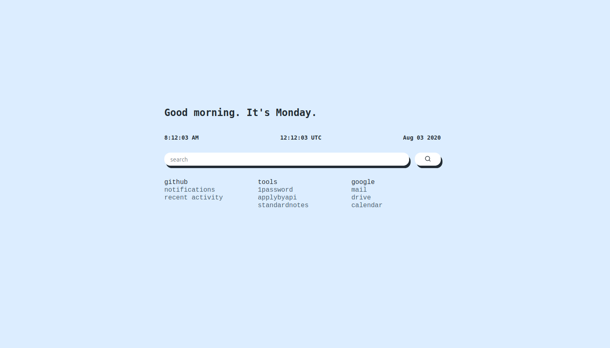
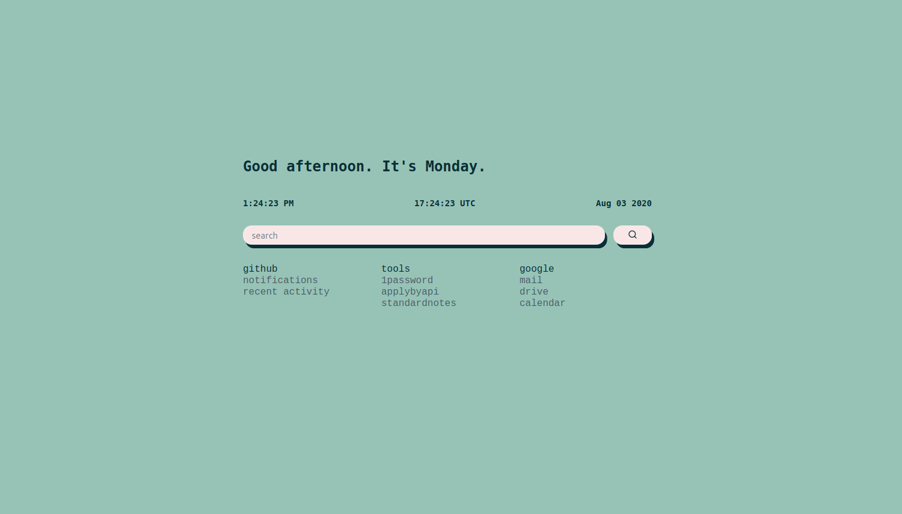
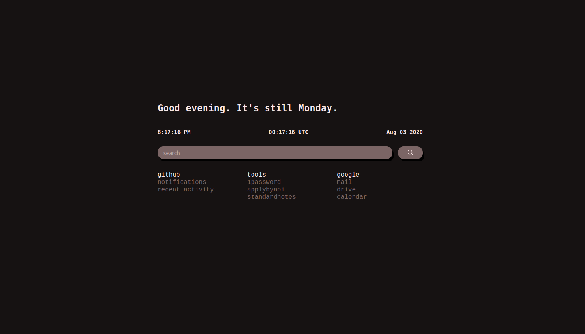

# start ☕

A new tab startpage or home page. Shows local and UTC time, day of the week and date, and features search (via [Startpage](https://www.startpage.com/)) and bookmarks you can version control.

There are three themes that change throughout the day.

## Usage

Fork this repo, change the links to your preferred sites if you like, and [set your GitHub Pages source](https://docs.github.com/en/github/working-with-github-pages/configuring-a-publishing-source-for-your-github-pages-site).

In your web browser, set the URL for new tab pages to your new start page, hosted by GitHub Pages. ✨

- [Set home page or new tab page in Firefox](https://support.mozilla.org/en-US/kb/how-to-set-the-home-page)
- [Set homepage or startup page in Chrome](https://support.google.com/chrome/answer/95314)
- [Change your homepage in Safari on Mac](https://support.apple.com/guide/safari/change-your-homepage-ibrw1020/mac)

You can also keep the page local by setting the URL to the filepath of `index.html` on your machine.
